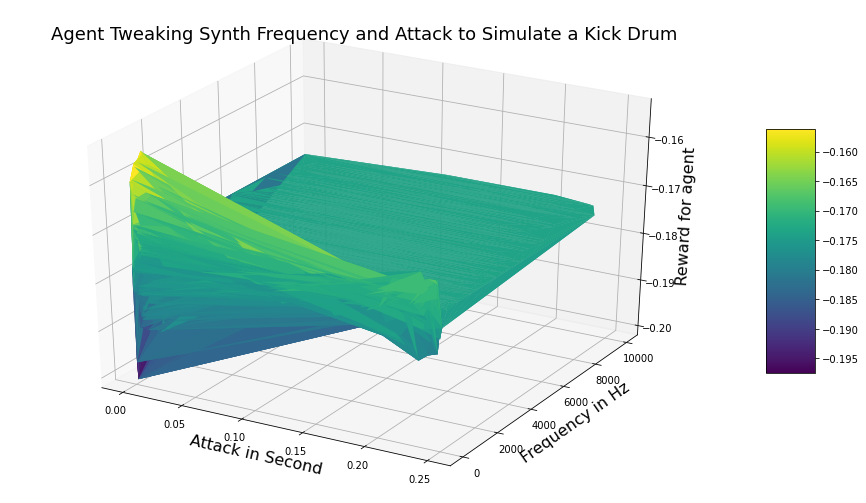

# RaveForce
RaveForce is a Python package that allows you to define your musical task in Python with [Glicol](https://glicol.org) syntax, and train an agent to do the task with APIs similar to the [OpenAI Gym](https://gym.openai.com).

Here is [an interactive example on the Google Colab](https://colab.research.google.com/drive/1mngiLHKrtCs4V2yfSfeILByCTtmdkPoJ?usp=sharing), you can play around with it.

## Why RaveForce

Let's consider a simple example: you want to train an agent to play the synth sequencer for you. The goal is to mimic a famous bass line. Therefore, in each `step`, the `agent` needs to make a decision on which note to play and what kind of timbre to make. The agent can have an `observation` of what has been synthesised, and the `reward` is calculated by comparing the similarity between the synthesised audio and the target at the moment.

Yet it can be very difficult and time-consuming to build a real-world environment (such as a music robot) to cover all the needs for electronic music. Another option is to use some built-in Python function to compose our `music tasks`, but still, for each task, you need to write some DSP function chains which will be unlikely for these codes to be used again in the real world. A better way is to find a commonplace between our simulation and real-world music practices. Live coding is exactly such a practice where the artist performs improvised algorithmic music by writing program code in real-time. What if we train a virtual agent to write (part of the) code to synthesis a loop for us?

The architecture looks like this:
```
Agent
-> Play around the live coding code
-> Live coding engine does the non-real-time synthesis
-> Get the reward, observation space, etc.
```

This process should involve some deep neural network as the synthesised audio is much more difficult to process than the symbolic sequences.

Previously, SuperCollider is used for RaveForce. See paper:
> Lan, Qichao, Jim Tørresen, and Alexander Refsum Jensenius. "RaveForce: A Deep Reinforcement Learning Environment for Music Generation." (2019).

But due to the speed limit of non-real-time synthesis on hard disk from SuperCollider, we switch to Glicol. 

Glicol is a new live coding language that can be accessed in the browsers:

https://glicol.org

The syntax of Glicol is very similar to synth or sequencers, which perfectly fits our needs. Plus, Glicol is written in Rust and can be called in Python via WebAssembly (there are other methods but wasm is used since it shares the same format with Glicol js bindings).

## How to use RaveForce

### Install
This is quite straightforward:
`pip install raveforce`

### Be familiar with Glicol syntax.

Visit Glicol website to get familiar with its syntax and concept:

https://glicol.org

### Python
Since we are going to define our own musical task, we should make some changes to the `make` method.

Let's consider the simplest example: just let the agent to play for 1 step, tweaking `attack`, `decay` and `freq` of a sine wave synth to simulate a kick drum.

```python
import raveforce
import librosa

target, sr = librosa.load("YOUR_KICK_DRUM_SAMPLE", sr=None)
dur = len(target) / sr

env = gym.make(
    """
     ~env: imp 0.1 >> envperc {} {}
    kick_drum: sin {} >> mul ~env
    """,
    total_step=1,
    step_len=dur,
    target = target,
    action_space=[
      ["lin", 0.0001, dur-0.0001], 
      ["rel", 0, lambda x: dur-0.0001-x], # related to para 0
      ["exp", 10, 10000]
    ]
)
```

Then, use as a normal `Gym` env:
```python
observation = env.reset()
action = env.action_space.sample()
print(action)

observation, reward, done, info = env.step(action)
plt.plot(observation) # make your own import matplotlib
print(reward, done, info)
```

In this example, after 2000 iterations, the rewards are quite clear that a low attack and a low freq is best to simulate a kick drum, which makes sense.

